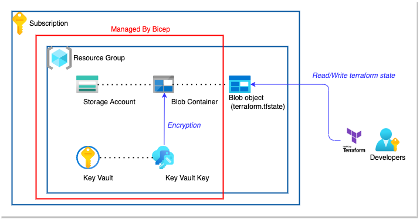

# create tfstate for azure

Set up tfstate storage using by Bicep.



## usage

### Set up parameter

Set up a parameter file with reference to `../example/bicepParams.json`.

### create resources

```bash
az deployment  sub create --template-file ./main.bicep --parameters @../example/bicepParams.json --location japaneast
```
